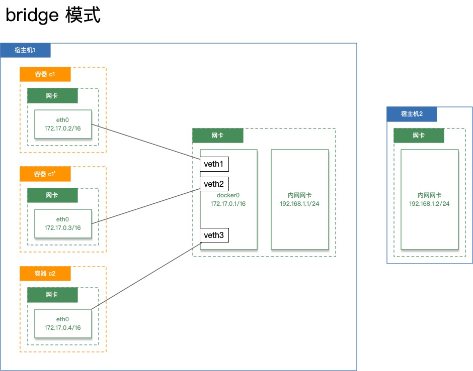

# 03网络相关

Docker 有以下4种网络模式：
- host 模式，使用 --net=host 指定。
- container 模式，使用 --net=container:NAME_or_ID 指定。
- none 模式，使用 --net=none 指定。
- bridge 模式，使用 --net=bridge 指定，默认为该模式。
## host 模式

Docker 使用了 Linux 的 Namespaces 技术来进行资源隔离，如 PID Namespace 隔离进程，Mount Namespace 隔离文件系统，Network Namespace 隔离网络等。一个 Network Namespace 提供了一份独立的网络环境，包括网卡、路由、 Iptable 规则等都与其他的 Network Namespace 隔离。一个容器一般会分配一个独立的 Network Namespace。但如果启动容器的时候使用 host 模式，那么这个容器将不会获得一个独立的 Network Namespace，而是和宿主机共用一个 Network Namespace。容器将不会虚拟出自己的网卡，配置自己的 IP 等，而是使用宿主机的 IP 和端口。
例如，我们在10.10.101.105/24的机器上用 host 模式启动一个含有 web 应用的容器，监听 tcp 80端口。当我们在容器中执行任何类似 ifconfig 命令查看网络环境时，看到的都是宿主机上的信息。而外界访问容器中的应用，则直接使用 10.10.101.105:80 即可，不用任何 NAT 转换，就如直接跑在宿主机中一样。但是，容器的其他方面，如文件系统、进程列表等还是和宿主机隔离的。

## container 模式

这个模式指定新创建的容器和已经存在的一个容器共享一个 Network Namespace，而不是和宿主机共享。新创建的容器不会创建自己的网卡，配置自己的 IP，而是和一个指定的容器共享 IP、端口范围等。同样，两个容器除了网络方面，其他的如文件系统、进程列表等还是隔离的。两个容器的进程可以通过 lo 网卡设备通信。

## none 模式

这个模式和前两个不同。在这种模式下，容器拥有自己的 Network Namespace，但是，并不为容器进行任何网络配置。也就是说，这个容器没有网卡、IP、路由等信息。需要我们自己为容器添加网卡、配置 IP 等。

## bridge 模式



### bridge 模式下的网络配置过程

1. 在宿主机上创建一对虚拟网卡 veth pair 设备。veth 设备总是成对出现的，它们组成了一个数据的通道，数据从一个设备进入，就会从另一个设备出来。因此，veth 设备常用来连接两个网络设备。
2. Docker 将 veth pair 设备的一端放在新创建的容器中，并命名为 eth0。另一端放在宿主机中，以 veth65f9 这样类似的名字命名，并将这个网络设备加入到 docker0 网桥中，在宿主机上安装 bridge-utils 工具后（`yum -y install bridge-utils`）可以使用命令`brctl show`查看到网卡关联。
3. 从 docker0 子网中分配一个 IP 给容器使用，并设置 docker0 的 IP 地址为容器的默认网关。

### bridge 模式下容器的通信

1. 在 bridge 模式下，连在同一网桥上的容器可以相互通信，若出于安全考虑，也可以禁止它们之间通信，方法是在 DOCKER_OPTS 变量中设置 --icc=false，这样只有使用 --link 才能使两个容器通信。
2. 容器也可以与外部通信，我们看一下宿主机上的 Iptable 规则，可以看到这么一条
    ```
    -A POSTROUTING -s 172.17.0.0/16 ! -o docker0 -j MASQUERADE
    ```
    这条规则会将源地址为172.17.0.0/16的包（也就是从容器中产生的包），并且不是从 docker0 网卡发出的，进行源地址转换，转换成宿主机网卡的地址。例如，假设宿主机有一块网卡为 eth0，IP 地址为10.10.101.105/24，网关为10.10.101.254。从宿主机上一个 IP 为172.17.0.2/16的容器中 ping 百度。IP 包首先从容器发往自己的默认网关 docker0，包到达 docker0 后，也就到达了宿主机上。然后会查询宿主机的路由表，发现包应该从宿主机的 eth0 发往宿主机的网关10.10.105.254/24。接着包会转发给 eth0，并从 eth0 发出去（主机的 ip_forward 转发应该已经打开）。这时候，上面的 Iptable 规则就会起作用，对包做 SNAT 转换，将源地址换为 eth0 的地址。这样，在外界看来，这个包就是从10.10.101.105上发出来的，从而使得容器对外是不可见的。
3. 外面的机器访问容器中的服务
    - 我们首先用下面命令创建一个含有 web 应用的容器，将容器的80端口映射到宿主机的10080端口。
        ```
        docker run --name b1 -p 10080:80 registry.cn-hangzhou.aliyuncs.com/maimidoudou6/mybusybox
        ```
    - 然后查看 Iptable 规则的变化，发现多了这样一条规则
        ```
        -A DOCKER ! -i docker0 -p tcp -m tcp --dport 10080 -j DNAT --to-destination 172.17.0.2:80
        ```
        此条规则就是对宿主机 eth0 收到的目的端口为10080的 tcp 流量进行 DNAT 转换，将流量发往172.17.0.2:80，也就是我们上面创建的容器。所以，外界只需访问10.10.101.105:10080就可以访问到容器中的服务。
    - **如果此时再用这个镜像创建一个容器 b2，那么端口映射就不能再是10080:80否则两个容器不能同时启动**